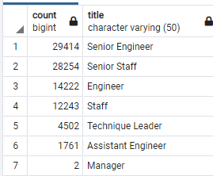
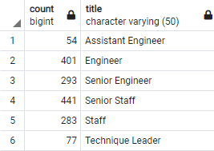

# Pewlett-Hackard-Analysis

## Overview of the analysis
A human resources analyst will be assisted with updating the Pewlett Hackard employees data currently available in the form of 6 CSV files. The tasks include building an employee DB with SQL by applying data modelling, engineering and analysis skills to generate a list of all employees eligible for the retirement package and to determine;
- the number of retiring employees by title.
- the employees who are eligible to participate in a mentorship program.

## Resources
- Data sources: This analysis was performed using [six_CSVs](https://github.com/aobasuyi/Pewlett-Hackard-Analysis/tree/main/Data_source) datasets
- Schema:  The entity relationship diagram (ERD) for the database is shown as [EmployeeDB](https://github.com/aobasuyi/Pewlett-Hackard-Analysis/blob/main/EmployeeDB.png)
- Software: PostgreSQL 12.7, pgAdmin 4
- Others: [Quick Database Diagrams](https://www.quickdatabasediagrams.com/)

## Results

A.  **The Number of Retiring Employees by Title:**<br /> <br />

A query was written and executed to create a **Retirement Titles** table for employees who are born between January 1, 1952 and December 31, 1955. Duplicate entries for some employees  were removed using the *DISTINCT ON* statement as shown

```
-- The number of retiring employees by title
SELECT e.emp_no,
    e.first_name,
e.last_name,
    t.title,
    t.from_date,
    t.to_date
INTO retirement_titles
FROM employees as e
INNER JOIN titles as t
ON (e.emp_no = t.emp_no)
WHERE (e.birth_date BETWEEN '1952-01-01' AND '1955-12-31')
ORDER BY e.emp_no;

-- 1.1: Use dictinct with orderby to remove duplicate rows
SELECT DISTINCT ON (r.emp_no) r.emp_no, 
r.first_name,
r.last_name,
r.title
INTO unique_titles
FROM retirement_titles AS r
ORDER BY r.emp_no ASC, r.to_date DESC;

```

**Finding:**<br />
1. There are more than **90,000** employees who are eligible for retirement by title.

2. Senior engineers (*n* = 29,414) are largest number of employees who are about to retire.  Manager anagers (*n* = 2) are the least number of employees by title who are eligible for retirement.

<br />  <br />

B.  **The Employees Eligible for the Mentorship Program:**<br /> <br />
The code determining for creating the mentorship-eligibility table:

```
--  The employees eligible for the mentorship program
SELECT DISTINCT ON (e.emp_no) e.emp_no,
	e.first_name,
	e.last_name,
e.birth_date,
	de.from_date,
    de.to_date,
	t.title
INTO mentorship_eligibilty
FROM employees as e
INNER JOIN dept_emp AS de
ON (e.emp_no = de.emp_no)
INNER JOIN titles as t
ON (e.emp_no = t.emp_no)
WHERE (de.to_date = '9999-01-01')
	AND (e.birth_date BETWEEN '1965-01-01' AND '1965-12-31')
	ORDER BY e.emp_no;``

```

**Finding:** <br />

1. There are more than **1500** employees who are eligible for the mentorship program.

2. Senior staff (*n* = 441) are the largest number of employees eligible for the mentorship program. Technique leaders are the least number of mentorship-eligibble employees by title.

<br />  <br />


**Summary:**<br /> <br />
The following provide more insight into the upcoming "silver tsunami." at Pewlett-Hackard <br />

A.  **The number of roles that need to be filled**<br />

- To determine the current employees who are eligible for retirement, a filter was added to the original query since some people from the original list may not even work with the company anymore.

```
SELECT DISTINCT ON (e.emp_no) e.emp_no,
    e.first_name,
e.last_name,
    t.title,
    t.from_date,
    t.to_date
INTO retirement_current
FROM employees as e
INNER JOIN titles as t
ON (e.emp_no = t.emp_no)
WHERE (e.birth_date BETWEEN '1952-01-01' AND '1955-12-31')
	AND (t.to_date = '9999-01-01')
ORDER BY e.emp_no;

```
**Finding:**
- The number of roles that will need to be filled will be about  **73,000** employees. This number is lower than the original list of all **90,000** employees eligible for retirement by title.

 <br />  <br />

B  **Will there be enough qualified, retirement-ready employees in the departments to mentor the next generation of Pewlett Hackard employees?**<br />
- There are about **1500** employees who are eligible for the mentorship program and about **73,000** employees who are eligible for retirement. 
- There are not enough eligible employees to mentor the next generation of PH employees. The ratio of retirement-ready to mentorship-eligible employees range from 35:1 to 100:1.

